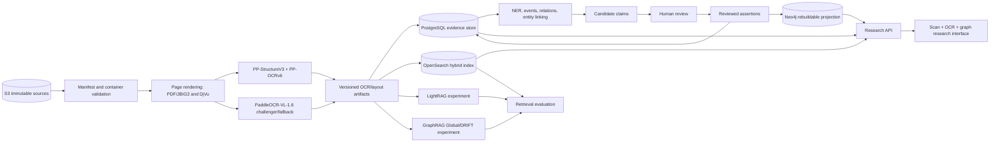

# Technical design: reconstructing women's history from *Shen Bao*

Status: selected architecture, benchmark plan, and tested one-page vertical slice
Research cutoff: 2026-07-18  
Scope: `s3://ccaa-us-east-1-504133794192/sb_raw/`

## 1. Executive decision

This project should not be built as “documents into one GraphRAG product.” The source is a large image archive, historical claims need page-level evidence, and machine-generated graphs are too unstable to serve as scholarly truth.

Use three distinct data planes:

1. **Evidence plane:** immutable sources, page geometry, OCR versions, annotations, candidate claims, reviewed assertions, and provenance. PostgreSQL is authoritative; S3 stores images and versioned derivatives.
2. **Search plane:** OpenSearch hybrid lexical+dense retrieval with reranking and exact page/region citations. This is the production baseline.
3. **Experimental graph plane:** rebuildable Neo4j projections and graph-RAG indexes. Start with LightRAG; benchmark Microsoft GraphRAG Global and DRIFT. Do not treat LazyGraphRAG as an installable OSS component.

The provisional OCR selection is **PP-StructureV3 + PP-OCRv6** for coordinate-preserving evidence extraction, with **PaddleOCR-VL-1.6** as a fallback/challenger on difficult regions. This is a benchmark hypothesis, not a final model lock.

### Verified implementation slice (2026-07-18)

- Dockerized PostgreSQL 17/pgvector 0.8.5, OpenSearch 3.7.0, and Neo4j Community 2026.06.0 are healthy and accept real queries/writes.
- The complete fast audit—401 objects and 400 numbered volumes—loads transactionally and idempotently into PostgreSQL.
- PaddleOCR 3.7.0 with PP-OCRv6 medium produced a coordinate-preserving 1,138-region smoke artifact for volume 219, page 308. It used 35 bounded-memory tiles; the input was a lossy screening JPEG, so this proves plumbing, not OCR quality.
- The explicitly multilingual `urchade/gliner_multi-v2.1` at commit `443d26d654e0324125a96bebd8e796c14ff2efe6` produced 115 exact-offset candidates. Manual inspection found substantial false positives from OCR noise, so every result remains an unlinked `candidate`; the model has not passed the NER gate.
- On an identical first-50-region subset, pinned GLiNER-X produced 67 candidates while multi-v2.1 produced 5; exact span/type agreement was 2 and candidate Jaccard 0.029. GLiNER-X also required forcing its Stanza splitter to `zh-hant` because language detection on short OCR fragments selected unrelated languages. The result demonstrates compatibility, much higher candidate volume and severe disagreement—not higher accuracy.
- On the source-resolution lossless OCR, an updated all-14-type, nested/multi-label first-50 comparison produced 82 GLiNER-X and 7 multi-v2.1 candidates, with 3 exact span/type agreements and candidate Jaccard 0.035. Rules found zero mentions across all 1,099 regions. Visibly implausible high-confidence fragments again rule out selection without adjudicated gold.
- BGE-M3 at commit `5617a9f61b028005a4858fdac845db406aefb181` produced 1,138 normalized 1,024-dimensional embeddings for the screening smoke run and 1,099 for the lossless pilot. Both histories remain in PostgreSQL/pgvector; the current OpenSearch v2 projection contains only the 1,099 regions from the active lossless OCR selection.
- OpenSearch CJK lexical, BGE-M3 dense, and client-side RRF hybrid retrieval return exact S3 volume/page/region polygons and propagate page-quality warnings. The query `富紳淑女` placed the two exact matching regions first in the hybrid result.
- Entity-link persistence retains an explicit NIL option. With no reviewed authority catalog yet, all 115 smoke mentions correctly remain NIL rather than manufacturing people. The grounded relation pass emits zero claims because no pair of reviewed linked entities exists.
- The local historian queue exposes all 276 persisted NER candidates across the legacy screening and lossless pilot runs with exact derivative, OCR, input hash/dataset split, model and link-candidate provenance. Dataset/run filters isolate the 82-candidate lossless GLiNER-X cohort from the older screening run. Mention acceptance and entity resolution are separate transactional decisions. An isolated live-database test accepted a synthetic span, created a reviewed entity from its NIL candidate, proved idempotent retries, and removed every fixture row; no historical candidate was changed.
- The claim-review queue exposes subject, predicate, object, extraction revision and cited scan passages. Acceptance requires at least one evidence record and reviewed referenced entities. A reversible live test approved a synthetic cited claim, detected the stale graph, rebuilt and verified the reified Neo4j claim, restored the empty baseline, and left zero fixture rows/nodes.
- The reviewed-only Neo4j projection was live-tested and correctly produced an empty graph from that state. A local FastAPI/researcher UI exposes lexical, dense and hybrid search, page images, historian review, reviewed-only analytical signals, and a scenario-context contract that abstains when no reviewed claims support a reconstruction.
- The active-selection RAG export accounts for all 1,099 lossless regions: 1,088 text-bearing regions map back from exact page-text character offsets to scan polygons and derivative/source hashes; 11 empty regions are recorded as omitted. GraphRAG and LightRAG receive the same version-isolated text input.
- Pinned GraphRAG 3.1.1 and LightRAG 1.5.4 package CLIs were installed and inspected in isolated environments. The shared-export validator, GraphRAG workspace preparation and authenticated LightRAG REST adapter are implemented; indexing is waiting for a recorded experiment LLM/embedding configuration and review-quality article units.
- Lexical, dense and hybrid retrieval each achieve Recall@5 1.0, MRR 1.0, citation-pointer rate 1.0 and derivative-pointer rate 1.0 on the single lossless exact-match pilot question. Historian-gold evidence rate is correctly 0.0. This validates metric plumbing only and is explicitly not a historian-facing quality result.
- The NER gold contract now requires two distinct independent reviews and an adjudication, validates corrected/raw exact offsets, and rejects duplicate identities/spans. Schema 1.1 separates model-independent gold region IDs from mapped OCR run/region IDs; prediction schema 1.1 freezes input variant/SHA-256, dataset split, ontology and adapter. The scorer reports exact/relaxed and per-type metrics, invalid evidence, OCR CER/loss, raw recoverability, end-to-end recall, decade/layout/quality strata, character/region throughput and recorded peak memory. It is tested on synthetic fixtures; no historical gold set exists yet.
- The OCR/layout gold contract likewise requires source-image hashes, dimensions, two reviews and adjudication, model-independent convex polygons and unique reading orders. Its scorer refuses mixed revisions or changed images and reports detection F1/IoU, area coverage, matched and reading-order CER, order/kind/direction accuracy, invalid geometry, throughput/memory and page strata. It is synthetic-fixture tested; the historical lossless gold renders remain pending.
- The selection-driven lossless renderer validates complete named screening decisions and verified cached/S3 source sizes, hashes each full source object, and refuses unsafe PDF composition/rotation. A non-gold page-308 pilot directly decoded the single 6176×8960 JBIG2 raster to PNG without geometric resampling and verified decoded-pixel identity before/after writing; the 2471×3584 screening JPEG is not reused.
- PP-OCRv6 then processed that source-resolution pilot in 54 bounded-memory tiles and produced 1,099 in-bounds, coordinate-preserving regions. The CLI verified the render manifest, PNG hash, S3 source identity and full source-object SHA-256 before model execution. This remains an explicitly non-gold pipeline result.
- PostgreSQL retains the screening JPEG and lossless PNG as two immutable `archive.page_derivative` rows. Evidence tier and resolution select the PNG as the preferred page image without deleting the JPEG; the API lists both and serves only registered, page-scoped derivatives with hash/tier headers.
- Each OCR artifact is bound to its exact page derivative in `evidence.ocr_run_input`. An append-preserving `page_ocr_selection` history superseded the screening OCR when the higher-tier lossless run arrived. OpenSearch projects only the active selection, and retrieval/review links carry the derivative UUID and hashes so older coordinates cannot silently cite a newer image.
- A PostgreSQL-backed ingestion scheduler now expands manifest-validated pages into the dependency DAG `render_lossless -> OCR -> {embedding, NER}`. Plans are content-addressed and idempotent; workers use atomic `SKIP LOCKED` leases, heartbeats, bounded retries, typed stage completion contracts, artifact checksums and append-only events. A source-resolution page-308 pilot completed all four jobs while reusing the already verified artifacts. Its NER job was explicitly planned for 50 regions; the scheduler rejected a mismatched 25-region completion before accepting the matching 50-region candidate-only run. This validates orchestration and provenance, not model quality or unattended corpus-scale operations.
- The executable `wic-worker` now runs or resumes each page stage. A second page-308 DAG automatically adopted the exact source render, OCR run, embeddings and bounded NER artifact after revalidating their model/configuration/input identities. A fresh render-only job for page 309 decoded the single JBIG2 raster to a 6186×8962 PNG with no geometric transform, recorded source/image/pixel hashes, and correctly labeled the derivative `unreviewed_ingestion` rather than gold. Aggregate indexing/export/projection stages and production fleet controls remain pending.
- Terminal failure propagation is now explicit. A forced three-attempt render failure moved the job to the dead-letter view, cancelled its unreachable OCR descendant, left zero blocked jobs and finalized the batch as `failed`; structured error details are available through the CLI and read-only API. A separate explicit cancellation revoked an active lease, cancelled the unfinished job and prevented further claims. Completed artifacts are preserved.
- Optional aggregate fan-in jobs are now executable: search waits for embeddings, citation-preserving RAG export waits for OCR, and reviewed-only graph projection waits for NER. A seven-job page-308 pilot completed with zero blocked/dead-letter jobs. It atomically moved `wic-regions-current` to `wic-regions-batch-3df9f4a1b5ef` with 1,099 documents; produced and independently validated one RAG document with 1,088 cited regions plus 11 accounted empty regions; and rebuilt an intentionally empty Neo4j projection with `reviewed_only=true`. Hybrid retrieval still returned `士女` first with exact source/derivative/region geometry after the alias swap.

The slice intentionally contains no reviewed historical entities or claims. Its insight endpoint therefore returns zero items with an explicit warning. It must not be described as a reconstructed knowledge graph until historian review data exists.

## 2. What the archive actually contains

| Format | Objects | Bytes | Interpretation |
|---|---:|---:|---|
| PDF | 395 | 167,284,981,412 | Predominantly scanned page-image volumes |
| DjVu | 5 | 1,772,878,220 | Scanned page-image volumes requiring a separate decoder |
| JPEG | 1 | 708,760 | Year-to-volume index |
| **Total** | **401** | **169,058,568,392** | About 157.4 GiB |

The index maps 400 volumes to 1872–1949. A complete representative PDF contains 599 pages of 300-DPI, 1-bit JBIG2 images. Text extraction from its first five pages produced no substantive text. This makes the archive **visual-document data**, not a text corpus.

The sample also revealed a quality risk: volume 73 is truncated and lacks `startxref`/`%%EOF`; nine other sampled PDF tails were structurally complete. Every object therefore needs validation before page processing.

Planning modalities:

- source containers: PDF, DjVu, JPEG;
- page raster: bitonal newspaper scan;
- page structure: columns, articles, notices, advertisements, tables, captions, images;
- transcription: original Traditional/historical Chinese plus a separate normalized search representation;
- geometry: page, region, line, and token polygons with reading order;
- derived semantics: mentions, entities, events, relations, claims, communities, and embeddings;
- human interpretation: corrections, review decisions, uncertainty, and narrative annotations.

There is no audio or video in the accessible prefix.

## 3. System architecture



### Non-negotiable boundaries

- The original S3 object is immutable and addressed by bucket, key, version where available, size, ETag, and SHA-256.
- OCR text never replaces the scan.
- Normalized Chinese never replaces the original transcription.
- A model-extracted edge is a `candidate_claim`, not a fact.
- Every answer must resolve citations to an issue/page/region that the user can inspect.
- Retrieval indexes and graph projections must be deletable and reproducible from authoritative records.

## 4. OCR and document understanding selection

PaddleOCR versioning must be stated precisely. As of the research cutoff, the toolkit is **PaddleOCR 3.7.0**; its current conventional family is **PP-OCRv6**, its modular document pipeline is **PP-StructureV3**, and its current compact document VLM is **PaddleOCR-VL-1.6 (0.9B)**. “PaddleOCR 3.0” alone is not a model selection.

### 4.1 Candidate comparison

| Candidate | Historic/Traditional Chinese | Layout and coordinates | Deployment/license | Decision |
|---|---|---|---|---|
| PP-StructureV3 + PP-OCRv6 | Chinese supported; *Shen Bao* accuracy unproven | Best candidate for fine-grained regions, text and table-cell coordinates; modular orientation/layout/recognition | Local CPU/GPU; Apache-2.0 | **Primary evidence-grade benchmark** |
| PaddleOCR-VL-1.6 | Officially claims improvements on ancient Chinese and rare characters | Strong page parsing/reading order; coordinates are less fine-grained than PP-StructureV3 | 0.9B, GPU preferred, local/API; Apache-2.0 | **Primary difficult-page challenger and fallback** |
| MinerU 3.3 | Native multilingual OCR; historical vertical Chinese unproven | Strong document parsing and reading-order JSON/visualization | Local CPU/GPU/MPS; custom license derived from Apache 2.0 | **End-to-end parsing challenger; legal review required** |
| GOT-OCR 2.0 | Chinese-aware compact model | Region/formatted OCR, but not a complete evidence geometry stack | Roughly 0.6–0.7B; Apache-2.0 model card | **Research challenger on hard subset** |
| Google Document AI Enterprise OCR | Chinese/Hani supported | Managed hierarchy and geometry | Proprietary managed service | **Cloud quality/cost control** |
| Docling | Quality depends on selected OCR backend | Strong orchestration and normalized document representation | MIT core; backend licenses vary | **Optional orchestration comparison, not an OCR model** |
| Surya | Chinese among 90+ languages | OCR, boxes, layout and reading order | GPL-3.0 code; weights/commercial terms need review | **Deferred** |
| olmOCR 2 | Current model/benchmark are English-focused | Strong English document linearization, weaker evidence geometry | 7B, Apache-2.0 | **Exclude from primary Chinese benchmark; optional negative control** |
| AWS Textract | Chinese is unsupported | Officially does not support vertical text | AWS managed | **Reject for this corpus** |

Primary documentation: [PaddleOCR repository](https://github.com/PaddlePaddle/PaddleOCR), [PaddleOCR releases](https://github.com/PaddlePaddle/PaddleOCR/releases), [PP-OCRv6 pipeline](https://www.paddleocr.ai/main/en/version3.x/pipeline_usage/OCR.html), [PP-StructureV3](https://www.paddleocr.ai/main/en/version3.x/algorithm/PP-StructureV3/PP-StructureV3.html), [PaddleOCR-VL-1.6](https://huggingface.co/PaddlePaddle/PaddleOCR-VL-1.6), [MinerU](https://github.com/opendatalab/MinerU), [GOT-OCR 2.0](https://github.com/Ucas-HaoranWei/GOT-OCR2.0), [olmOCR](https://github.com/allenai/olmocr), [Surya](https://github.com/datalab-to/surya), [Docling](https://github.com/docling-project/docling), and [AWS Textract limits](https://docs.aws.amazon.com/textract/latest/dg/limits.html).

### 4.2 Proposed OCR flow

```text
validated page raster
  -> PP-StructureV3 layout, region classes, orientation and reading order
  -> PP-OCRv6 transcription for every text region
  -> confidence/disagreement rules select difficult regions
  -> PaddleOCR-VL-1.6 reprocesses those regions or full pages
  -> retain both hypotheses; never silently overwrite
  -> human correction/review for gold data and important claims
```

Canonical OCR artifacts should use PAGE XML, ALTO XML, or equivalent versioned JSON that retains polygons, hierarchy, reading order, raw output, confidence, model/version, rendering parameters, and correction history. Markdown is a retrieval derivative, not the authoritative format.

### 4.3 OCR benchmark gate

Create 150–250 double-reviewed pages stratified across decades, PDF/DjVu, clean/degraded scans, vertical/mixed direction, advertisements, dense classifieds, photographs/captions, tables, rare glyphs, bleed-through, skew, gutters and cropping.

Benchmark:

- A: PP-StructureV3 + PP-OCRv6 medium;
- B: PaddleOCR-VL-1.6;
- C: modular pipeline plus VL fallback;
- D: MinerU 3.3;
- E: Google Document AI Enterprise OCR;
- F: GOT-OCR 2.0 on a 50-page hard subset.

Report Traditional-Chinese CER, rare-character recall, line/region detection F1 and IoU, article-boundary F1, reading-order accuracy, vertical-text CER, unsupported-span/hallucination rate, coordinate coverage, downstream entity recall, calibration, pages/hour, failure rate, GPU memory and cost/page.

Select the system with the best **evidence fidelity and downstream entity recall**, not the cleanest Markdown or a modern-document leaderboard score.

## 5. Evidence and knowledge model

Use three truth states:

1. **Observation:** immutable source, rendered page, region, OCR hypothesis and human transcription.
2. **Candidate:** machine-proposed mention, link, event, relation or claim.
3. **Reviewed assertion:** accepted, rejected, disputed or superseded through a recorded review decision.

Do not store only `Person -[:MEMBER_OF]-> Organization`. Reify the assertion:

```text
Claim
  subject -> Person
  predicate -> member_of
  object -> Organization
  asserted_event_time -> interval/unknown
  publication_time -> issue date
  evidence -> page region + text offsets
  OCR run -> model/version/confidence
  extraction run -> model/prompt/schema/version
  epistemic status -> candidate/reviewed/disputed/rejected
  reviewer decision -> agent/time/note
```

Publication time, described event time, extraction time, and review time are distinct.

### Standards profile

Use a deliberately small application profile rather than adopting a large ontology wholesale:

- [CIDOC CRM 7.3.1](https://cidoc-crm.org/sites/default/files/cidoc_crm_version_7.3.1_1_0.pdf) for cultural-heritage events, people, groups, places, time-spans, objects and appellations;
- [W3C PROV-O](https://www.w3.org/TR/prov-o/) for model, pipeline and reviewer provenance;
- [W3C Web Annotation](https://www.w3.org/TR/annotation-model/) for claims/transcriptions targeting page regions and text offsets;
- SHACL validation for RDF/JSON-LD exports;
- stable public URIs separate from display labels.

## 6. Database selection

| Technology | Role | Selection rationale |
|---|---|---|
| PostgreSQL | Catalog, annotations, claims, reviews, versions and authoritative records | ACID constraints, auditability, migrations, temporal data and reproducibility |
| pgvector | Candidate-link and passage embeddings tied to authoritative IDs | Keeps vector prototypes near evidence records; current 0.8.x supports HNSW/IVFFlat |
| OpenSearch | Production hybrid lexical/dense retrieval | Better operational search layer for n-grams, OCR variants, filters, RRF-style fusion and scale |
| Neo4j Community | Researcher graph exploration and derived projection | Mature Cypher and graph UX; rebuildable to avoid dual-write authority problems |
| Apache Jena/Fuseki | RDF export validation and interoperability prototype | Standards-first SPARQL/SHACL tooling; not required as the main runtime |
| Amazon Neptune | Future managed RDF/property-graph option | Defer until HA, security, workload and budget require a managed graph service |

Alternatives not selected initially:

- Apache AGE: useful SQL/Cypher experiment but smaller ecosystem and version compatibility burden;
- Kuzu: reject as a new core dependency because the official repository was archived in 2025;
- Memgraph: no demonstrated advantage over Neo4j for this workload;
- Ontotext GraphDB: capable semantic tooling but adds licensing and operational decisions before the need is proven.

Official references: [Neo4j operations/editions](https://neo4j.com/docs/operations-manual/current/introduction/), [Amazon Neptune](https://docs.aws.amazon.com/neptune/), [Apache AGE](https://age.apache.org/overview/), [Apache Jena](https://jena.apache.org/), [pgvector](https://github.com/pgvector/pgvector), and [Kuzu archive](https://github.com/kuzudb/kuzu).

## 7. NER, relation extraction and entity linking

NER is not entity linking. The pipeline must retain OCR uncertainty, identify a mention span, propose candidate identities and allow `NIL/new entity` rather than forcing a match.

### 7.1 Candidate comparison

| Candidate | Role | Selection |
|---|---|---|
| Rules + historical gazetteers | Dates, issue structure, titles, addresses, institutions, known people/places | **Required high-precision layer** |
| GLiNER-X large, revision `4a4437f…` | 865M multilingual open-type span NER | **Primary open-span challenger**; reported `zh_pud` F1 0.6794, but no Traditional/historical/OCR result |
| SIKU-BERT, revision `fc656de…` + project span/CRF head | Historical-Chinese supervised NER | **Primary supervised challenger after gold annotation**; historical pretraining is relevant but Siku prose differs from newspaper OCR |
| NuExtract3, revision `2e9fca8…` | Multimodal schema extraction | **Difficult-case/relation challenger**; require valid JSON, verbatim evidence and exact offset recovery |
| Qwen3.5-9B, revision `c202236…` | Chinese-capable multimodal JSON-schema control | **Higher-compute control**, not the batch default |
| GLiNER multi v2.1, revision `443d26d…` | Existing multilingual smoke baseline | **Retain as a measured baseline**; its one-page noisy output is not production quality |
| GLiNER large v2.5 | Prompted/open-type span NER | **Lower-priority control**; no published Chinese evaluation was found to justify prioritizing it |
| UniNER 7B | Generative universal NER | **Reject as production core** due English focus and non-commercial model license |

The exact registry, roles and revisions are committed in `experiments/ner/candidates.json`; model names alone are not reproducible selections. Generic leaderboards do not settle this choice. GLiNER-X's official card improves over GLiNER multi v2.1 on `zh_pud`, while SIKU-BERT has directly relevant historical-Chinese pretraining and published downstream ancient-text results, but neither tests Traditional-Chinese *Shen Bao* scans. NuExtract3 and Qwen are controls for schema adherence and page-image context, not assumed NER winners. Relevant sources include the [GLiNER-X model card](https://huggingface.co/knowledgator/gliner-x-large), [SIKU-BERT model card](https://huggingface.co/SIKU-BERT/sikubert), [NuExtract3 model card](https://huggingface.co/numind/NuExtract3), [Qwen3.5-9B model card](https://huggingface.co/Qwen/Qwen3.5-9B), [GLiNER v2.5 model card](https://huggingface.co/gliner-community/gliner_large-v2.5), and a directly relevant [historical Chinese NER/entity-linking/coreference/relation dataset](https://www.lrec-conf.org/proceedings/lrec-coling-2024/pdf/2024.main-1.35.pdf).

The first technical smoke test used the explicit multilingual v2.1 checkpoint because its official card identifies it as a 209M multilingual Apache-2.0 model. Its poor unreviewed output on noisy *Shen Bao* OCR confirms that generic model-card claims and confidence scores are not sufficient. High scores such as single-character kinship terms classified as people still occurred. Benchmark future models on corrected gold text and raw OCR separately to distinguish OCR propagation from NER failure.

### 7.2 Proposed extraction flow

```text
article/region OCR with character offsets and polygons
  -> rules/gazetteers + multilingual/open NER + supervised Chinese NER
  -> merge candidates without discarding disagreements
  -> entity-link candidate generation from aliases, variants, transliterations and embeddings
  -> rerank using date, place, organization, co-reference and graph context
  -> schema-constrained LLM proposes events/relations with exact supporting spans
  -> reject invalid JSON, missing offsets, ungrounded entities and unsupported relations
  -> human review and merge/split/NIL decisions
```

Store OCR confidence, mention score, entity-link score and relation score independently. Do not multiply uncalibrated scores into a misleading single probability.

The gold set should report strict and partial span F1 by entity type, candidate recall@k, linking accuracy including NIL, relation F1 conditional on correct evidence, calibration and performance by OCR CER/decade. Evaluate paired corrected-text and raw-OCR inputs; split by issue/date; add hallucinated-span rate, invalid evidence/offset rate, throughput and peak memory. This separates OCR propagation from entity-model failure and prevents newspaper-template leakage.

The current production hypothesis is a cascade, subject to that benchmark: deterministic rules/gazetteers; SIKU-BERT with a project-trained head plus GLiNER-X candidate union; NuExtract3 only for disagreement, rare types, page-image context and implicit relations. Every stage can abstain. No model output creates an authority entity or reviewed claim without a separate link/review decision.

The first controlled GLiNER-X compatibility run strengthens the need for that gate. Its 50-region subset generated 13.4 times as many candidates as GLiNER multi-v2.1, including apparently noisy high-confidence fragments, while the two systems agreed on only two exact span/type candidates. Generic `zh_pud` performance cannot determine the precision/recall tradeoff on this archive. The implementation now records a fixed word-splitter language and a bounded-region scope; automatic language detection is prohibited for these short known-Chinese regions.

Initial entity types: person, alias/appellation, kinship term, place, address, organization, school, occupation, title/role, publication, event, date, product and advertisement. Historians must approve this ontology using real pages before batch extraction.

## 8. Retrieval and GraphRAG selection

### 8.1 Comparison

| System | Current reality | Decision |
|---|---|---|
| Hybrid lexical+dense retrieval | Mature, cheap and naturally cites exact regions; n-grams help names and OCR variants | **Mandatory production baseline** |
| Microsoft GraphRAG 3.1.1, revision `14a00ad…` | Real MIT Python/CLI; extracts graph/claims, Leiden communities and reports; outputs Parquet; Local/Global/DRIFT/Basic query modes; costly indexing and no first-class normal delete flow found | **Benchmark Global and DRIFT on bounded corpus in an isolated environment** |
| LazyGraphRAG | Microsoft research/product method using cheap NLP graph construction and deferred query-time LLM work; not an OSS GraphRAG CLI mode | **Track or reproduce later; do not specify as deployable component now** |
| LightRAG 1.5.4, revision `9a45b64…` | Active MIT implementation with incremental insertion, deletion/KG regeneration, citations, reranking, multiple stores and current multimodal adapters | **First experimental graph-RAG implementation, pinned and isolated; do not use the 1.5.5 release candidate** |
| RAG-Anything | Multimodal parsing adapter around LightRAG | **Optional adapter only; does not replace evidence-grade OCR** |
| HippoRAG 2 | Research implementation for associative/multi-hop retrieval and continual memory | **Later multi-hop challenger** |
| RAPTOR | Batch hierarchical clustering/summarization tree | **Low priority; OCR errors may propagate into summaries** |
| Graphiti | Temporal agent-memory graph with episode lineage | **Borrow concepts; do not adopt as archival evidence model** |
| MiroFish | AGPL multi-agent simulation/prediction application | **Exclude from ingestion, evidence graph and factual retrieval; consider only a separately labeled speculative sandbox much later** |

Primary references: [GraphRAG repository](https://github.com/microsoft/graphrag), [GraphRAG indexing](https://microsoft.github.io/graphrag/index/overview/), [GraphRAG CLI](https://microsoft.github.io/graphrag/cli/), [LazyGraphRAG](https://www.microsoft.com/en-us/research/blog/lazygraphrag-setting-a-new-standard-for-quality-and-cost/), [LightRAG](https://github.com/HKUDS/LightRAG), [RAG-Anything](https://github.com/HKUDS/RAG-Anything), [HippoRAG](https://github.com/OSU-NLP-Group/HippoRAG), [RAPTOR](https://github.com/parthsarthi03/raptor), [Graphiti](https://github.com/getzep/graphiti), and [MiroFish](https://github.com/666ghj/MiroFish).

### 8.2 Why LazyGraphRAG is not selected now

Microsoft reports vector-RAG-equivalent indexing cost, 0.1% of full GraphRAG indexing cost and strong query-cost/quality results. But the published experiment used 5,590 English AP articles, synthetic questions and LLM pairwise judging. More importantly, the official open-source GraphRAG CLI currently exposes Basic, Local, Global and DRIFT—not Lazy. LazyGraphRAG is associated with Microsoft Discovery and Azure Local preview. It is promising research, not a self-hosted dependency we can honestly place in the implementation diagram.

### 8.3 Retrieval evaluation gate

Historians should author 30–50 initial questions, growing toward 100+, across:

- exact name/date/address lookup;
- alias and OCR-variant lookup;
- multi-hop relationships across articles;
- temporal sequence, disagreement and contradiction;
- whole-corpus themes/trends;
- negative/unanswerable questions;
- exact scan-region trace tasks.

Compare OpenSearch hybrid retrieval, LightRAG, GraphRAG Global and GraphRAG DRIFT. Later add HippoRAG for multi-hop questions. Report Recall@k, nDCG, citation-region precision, evidence entailment, answer completeness, hallucination/abstention, latency, indexing/query cost, update correctness and delete completeness.

A graph approach enters production only where it materially outperforms the hybrid baseline without weakening citations.

`wic-rag-export` creates the shared comparison input: plain page text, a JSONL form of the same documents, and a sidecar mapping exact character offsets to OCR-region UUIDs, polygons and scan URIs. Page units are a smoke-test compromise; the scored experiment waits for reviewed article segmentation. Generated graph entities, relations, community reports and summaries never flow back into the evidence plane as reviewed facts.

## 9. Storage and identifiers

Minimum authoritative records:

- `source_object`: S3 identity, checksum, format, integrity state;
- `volume`, `issue`, `page`: bibliographic and image identity;
- `region`, `line`, `token`: polygons, reading order and region class;
- `ocr_run`, `ocr_hypothesis`, `correction`: model/version and text lineage;
- `article`: grouped page regions with versioned segmentation;
- `mention`, `entity`, `entity_link_candidate`, `entity_resolution_decision`;
- `event`, `claim`, `claim_evidence`, `review_decision`;
- `model_run`, `prompt`, `schema_version`, `software_environment`;
- `embedding`, `index_projection`, `graph_projection` with reproducible build IDs.

Use stable opaque IDs; never use a name label as identity. Every derivative includes parent IDs and a build/run ID.

## 10. Security, reproducibility and cost

- Replace long-lived CSV access keys with a least-privilege role and temporary credentials before automation.
- Keep raw data read-only; write derivatives to separate versioned prefixes/buckets.
- Encrypt data at rest and in transit; log access and model runs.
- Pin model weights by immutable revision/digest, containers by digest, prompts and schemas in Git.
- Record compute type, dependency lock, language normalization rules and random seeds.
- Do not send full archives or sensitive annotations to third-party APIs without rights/privacy review.
- Estimate cost from measured pages/hour and cost/page after the benchmark; do not extrapolate vendor claims.
- Require license review before adopting MinerU, Surya weights, managed APIs or any non-Apache/MIT component.

## 11. Delivery phases and gates

### Phase 0 — corpus audit

- Build complete manifest and checksums.
- Validate PDF/DjVu structure and quarantine/repair malformed containers.
- Measure page counts, raster properties and duplicate pages.
- Output: trustworthy corpus inventory.

### Phase 1 — gold benchmark

- Render 150–250 stratified pages.
- Double-transcribe selected regions and annotate layout/entities/links/relations.
- Run OCR and extraction comparisons.
- Gate: select OCR only after metric and cost review.

### Phase 2 — evidence/search vertical slice

- Implement S3 derivatives, PostgreSQL evidence schema and OpenSearch hybrid index.
- Build scan/OCR side-by-side review UI.
- Process three volumes, one each from 1924, 1925 and 1926.
- Gate: citation accuracy and historian usability.

### Phase 3 — graph experiments

- Build reviewed Neo4j projection.
- Run LightRAG and GraphRAG Global/DRIFT on identical article units.
- Compare against hybrid retrieval on historian-authored questions.
- Gate: graph approach must demonstrate question-category-specific value.

### Phase 4 — bounded scale-up

- Process 1924–1926 volumes 199–230 after measuring total pages and compute.
- Fine-tune OCR/NER only if error analysis demonstrates value.
- Validate and scale the implemented mention, entity-resolution and claim queues; add an adjudication/reversal workflow.

### Phase 5 — narratives and scene reconstruction

- Build only from reviewed claims and cited visual evidence.
- Label every element as directly evidenced, inferred/plausible or speculative.
- Keep MiroFish/agent simulations isolated from factual search and clearly marked synthetic.

## 12. Immediate implementation backlog

1. Finish human review of the 500-page visual screen and select 150–250 gold pages.
2. Pilot and approve the drafted annotation guidelines for original characters, normalization, layout and women-centered entities.
3. Use the implemented selection-driven renderer to create lossless gold pages, then run PP-StructureV3/PP-OCRv6 versus the difficult-page challengers.
4. Use the implemented OCR/layout and NER gold validators/scorers against double-reviewed annotations.
5. Have historians test the implemented mention/entity-resolution and cited-claim queues without promoting current GLiNER smoke outputs.
6. Create reviewed article segmentation and historian-authored retrieval questions.
7. Use the implemented shared export to evaluate LightRAG and Microsoft GraphRAG only after the hybrid baseline is scored.

## 13. Selected technologies, pending benchmark

| Layer | Provisional selection | Status |
|---|---|---|
| Source/archive | Existing S3 raw prefix + new versioned derivative area | Selected architecture |
| Validation/rendering | PDF/JBIG2 and DjVu-aware batch pipeline | Screening and source-resolution non-gold pilot implemented; historian-selected gold pending |
| Evidence OCR | PP-StructureV3 + PP-OCRv6 | Source-resolution pipeline pilot and adjudicated gold contract/scorer implemented; scored historical gold pending |
| Difficult OCR | PaddleOCR-VL-1.6 | Benchmark fallback candidate; identical-image comparison pending |
| Authoritative database | PostgreSQL 17 | Implemented and live-tested locally |
| Embeddings near evidence | pgvector 0.8.5 + BGE-M3 challenger | Implemented for smoke slice; benchmark pending |
| Production retrieval | OpenSearch 3.7 CJK + BGE-M3 + RRF | Implemented baseline and smoke metrics; reranker/historian evaluation pending |
| Graph exploration | Neo4j Community derived projection | Selected for pilot if graph questions justify it |
| Standards export | CIDOC CRM profile + PROV-O + Web Annotation, validated with Jena/SHACL | Selected architecture |
| NER | Rules + SIKU-BERT supervised head + GLiNER-X union; NuExtract3 difficult-case challenger | Registry, adjudicated-gold contract and scorer implemented; historian annotation/model comparison pending |
| Relation/event extraction | Schema-constrained Chinese-capable LLM with grounded offsets | Benchmark/model selection required |
| Human review and insights | Transactional PostgreSQL decisions + reviewed-only Neo4j analytical signals | Mention, entity-resolution and cited-claim queues implemented; graph staleness and reversible projection tested; adjudication/reversal pending |
| Graph-RAG experiment | LightRAG 1.5.4 (`9a45b64…`) | Selected first isolated experiment; shared export implemented |
| Graph-RAG comparator | Microsoft GraphRAG 3.1.1 (`14a00ad…`) Global + DRIFT | Selected bounded experiment; shared export implemented |
| LazyGraphRAG | Track product/research availability | Not currently selected as deployable OSS |
| Model handoff | OpenAI-compatible adapter with prompt hashing and untrusted-OCR boundary | Implemented; live model not configured; scene generation abstains without reviewed claims |
| Evaluation | Frozen OCR/NER/RAG judgments with evidence-validity and task metrics | OCR/NER contracts and scorers plus retrieval smoke harness implemented; historian-authored sets pending |
| Simulation | None in factual system | Explicitly deferred |
